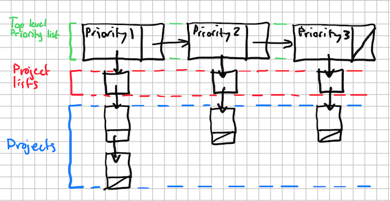

Jack Thake • CS163 • Karla Fant • 10.6.20

# Design Write up for Program One
## Abstract
This program will contain several classes and structures representing a list of
home improvement projects. At the highest level, The manager class
(**CS_project_manager**) will contain a linear linked list where each node holds a
list that contains all projects of that corresponding priority.



### Classes and structures
This Will be achieved by creating two classes and 3 structures.
The first class being the top level manager of the priority list -
**CS_project_manager**, This will also be the class that the client
communicates with, all the others will be shielded away. The
second class being the container fo each list of individual
projects - **CS_project_list**. To make these two classes work three structures
are needed, those are as follows:
- **CS_project_manager_node**: Represents one node in **CS_project_manager**'s
  list. It will contain the following data members:
  - **CS_project_list**: The data for a given node, contains a list of projects.
  - **priority**: The priority of the **CS_project_list**.
  - **next**: A pointer to the next node in the top level list.
- **CS_project_list_node**: Represents one node in **CS_project_list**'s list. it
  will contain the following data members:
  - **CS_project**: One individual project.
  - **next**: A pointer to the next node in the list
- **CS_project**: Represents one project in the list. It will contain the following
  data members:
  - **name**: The name of the project.
  - **estimated_cost**: The estimated cost of the whole project.
  - **project_length**: The projected amount of time for that project to be completed
  - **workers**: The name of any hired workers or companies, ```NULL``` if there are none.
  - **completion_date**: The estimated date of completion.
  - **project_coolness**: A very objective rating out of 5 on how cool the project is, 0
    being pretty lame, 5 being very epic.

---
## Error reporting
Each function will report errors by integer values, those integers can then be interpreted
by the enum **CS_error**. Those error states being:
- **FAILURE**: Function was not successful.
- **SUCCESS**: Function was successful.
- **MEM_ALLOC_FAIL**: Memory failed to be allocated.

---
## Class Member Functions
### **CS_project_manager**:
- `constructor`: This will take no arguments and simply prepare the internal list
  pointers. It will return nothing.
- `destructor`: This will take no arguments and oversee the deallocation of all
  dynamic memory. It will return nothing.
- `add_priority`: This will take in an integer value, that value representing the
  priority level of the new list. The function will then add a node with the corresponding
  priority set. returning **SUCCESS** if the node was successfully allocated, **MEM_ALLOC_FAIL**
  otherwise.
- `remove_priority`: This will take in an integer value, that value representing the
  priority level to be removed. The function will then iterate through the list until
  it finds a matching priority, deallocating that node and returning **SUCCESS**, or
  returning **FAILURE** if the node could not be found.
- `display_priority`: This will take in an integer value, that value representing
  the priority level to be displayed to the user. The function then iterates through
  the list until it finds a matching priority. Once a match is found, we call the matching
  priority's node's display member function and return it's return value. If no match is found,
  **FAILURE** is returned.
- `display_all`: This will take no parameters. It will then iterate through the list,
  calling each node's display member function. If one node returns **FAILURE** then it
  will also return **FAILURE**, otherwise it will return **SUCCESS**.

### **CS_project_list**:
- `constructor`: This will take no arguments and simply prepare the internal list
  pointers. It will return nothing.
- `destructor`: This will take no arguments and oversee the deallocation of all
  dynamic memory. It will return nothing.
- `add_item`: This will take in an initialized **CS_project** structure. The Function
  will then attempt to add the structure to it's list, returning **MEM_ALLOC_FAIL** if
  the node cannot be created, **SUCCESS** otherwise.
- `display`: This will take in no parameters. It will then attempt to print out the
  entire list to the user, returning **FAILURE** if the list is empty, **SUCCESS**
  otherwise.
